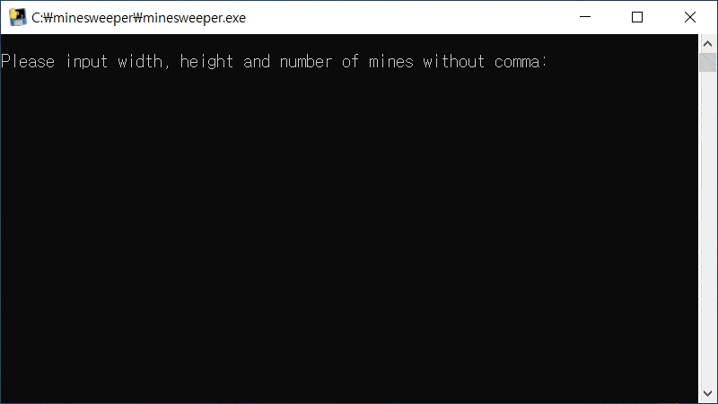

# Minesweeper
Simple minesweeper implementation using numpy, scipy and ANSI escape codes.

Tested on Windows 1909, other versions/OSs not tested but may run well on systems that support ANSI escape codes.
